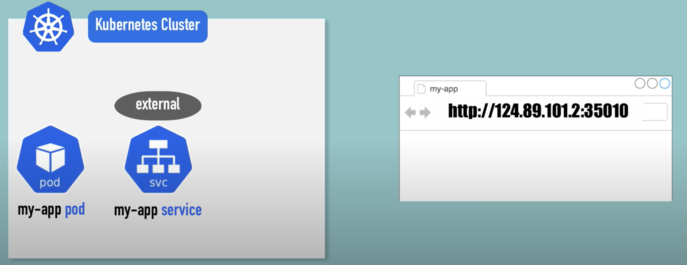
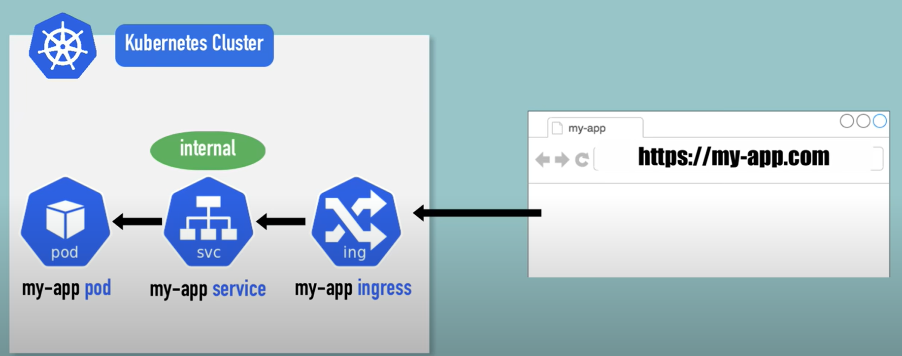
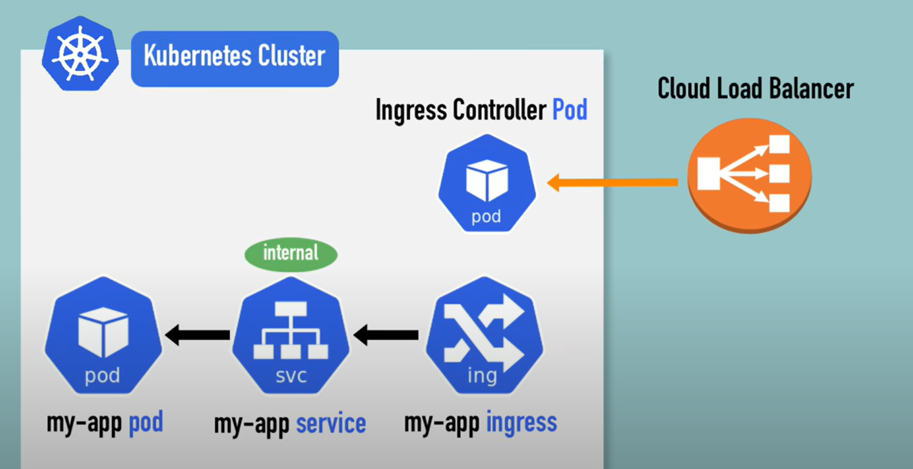
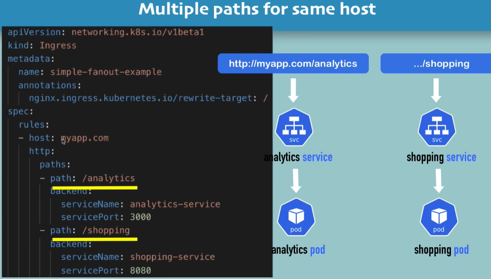
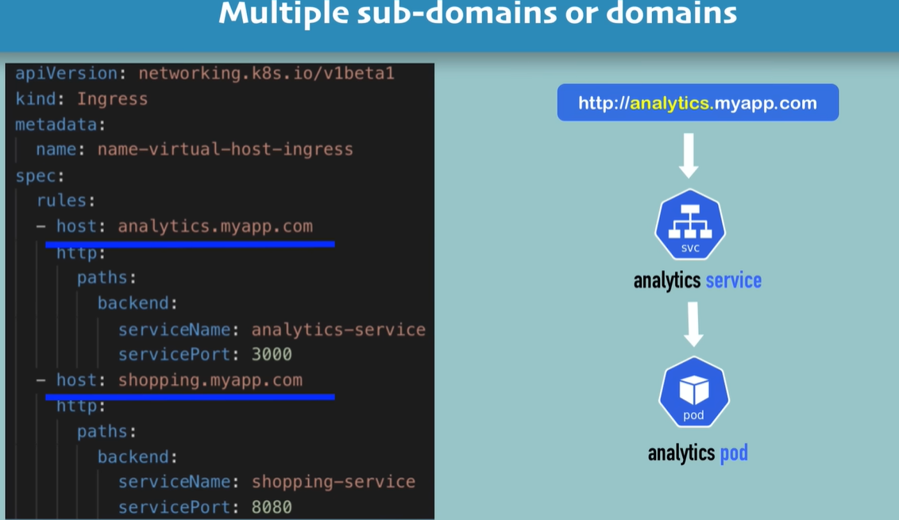

# External Access in Kubernetes
By default, applications (Pods or Services) running inside a Kubernetes cluster are **not accessible from outside** the cluster:
- Pods are assigned **internal IPs only**.
- Services of type `ClusterIP` (the default) are reachable **only within the cluster**.

To make an application accessible from outside the cluster, you can:
- Use a **Service** of type `NodePort` or `LoadBalancer` (limited flexibility and control).
- Use an **Ingress**, which is the **recommended and more powerful solution** for managing external HTTP/HTTPS traffic.

## Internal Service vs External Service
Internal Service: <br>
- **Internal Service** refers to a Kubernetes Service that is accessible **only within the cluster**.
- It is typically of type `ClusterIP`, which means it has an internal IP address and can only be accessed by other Pods or Services within the same Kubernetes cluster.
- Internal Services are used for communication between different components of an application that do not need to be exposed to the outside world.

External Service: <br>
- **External Service** refers to a Kubernetes Service that is accessible **from outside the cluster**.
- It can be of type `NodePort`, `LoadBalancer`, or managed through an **Ingress** resource.
- External Services are used to expose applications to the internet or other external networks, allowing users to access them via a public IP address or domain name.



# What is Ingress?
**Ingress** is a Kubernetes component that:
- Acts as a **gatekeeper** or **web gateway** for the cluster.
- **Routes external HTTP/HTTPS traffic** to the correct internal service.
- Supports **host-based** and **path-based** routing.
- Allows you to configure **TLS (HTTPS)** and manage domain-based access.

Ingress is ideal for exposing web applications to the internet in a **controlled and secure** way.



## How Ingress Works? -  Step by Step
1. User sends a request from outside the cluster
   - E.g. Someone visits https://myapp.com/products

2. DNS maps the domain to the Ingress controller's external IP
   - The domain myapp.com points to the public IP of the Ingress Controller (like NGINX, Traefik, etc.)

3. Ingress controller receives the request
   - This controller is a pod running inside your cluster.
   - It listens for external HTTP/HTTPS traffic.

4. Ingress controller matches rules in the Ingress resource
   - Ingress resource contains routing rules like:
     > - Path: /products → service: product-service 
     > - Host: api.myapp.com → service: api-service

5. Request is forwarded to the right Service
   - The Service (e.g. product-service) then forwards the request to the appropriate Pod(s).

6. Pod processes the request and sends back a response
   - The response flows back through the Service → Ingress Controller → back to the user.




## Use Cases
1. Multiple Paths for same host <br>

 
2. Multiple domains or subdomains <br>



## Install Ingress Controller in minikube
```
minikube addons enable ingress
```
It automatically starts the K8s Nginx implementation of Ingress Controller. <br>

To verify if the Ingress Controller is enabled/disabled, you can use the following command:
```
minkube addons list (and look for ingress and check if it's enabled/disabled)

kubectl get ns (and look for ingress-nginx namespace)

kubectl get pod -n ingress-nginx (and check if the pods are running)
```

# Gateway API
The **Gateway API** is a set of resources that provide a more flexible and extensible way to manage ingress traffic in Kubernetes. It is designed to address some limitations of the traditional Ingress resource and offers advanced features such as:
> https://gateway-api.sigs.k8s.io/guides/migrating-from-ingress/
