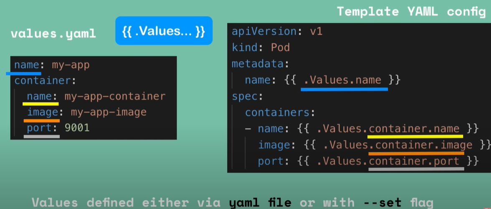

# Package manager
- Tool that helps install, update, configure and remove softwares.
- Automatically handles dependencies and versions.
- Examples: choco & winget (installing windows apps & tools), pip (for python), npm (for node.js), apt (for ubuntu), yum (for centos), helm (for kubernetes).

# Helm: The Kubernetes Package Manager
- Helm is the package manager for Kubernetes.
- Helm installs apps into Kubernetes clusters, managing all their complex YAML configs.
- It simplifies deploying and managing applications on Kubernetes.
- It uses "charts" (pre-configured packages) to define, install, and upgrade applications.
- Helm charts can include multiple Kubernetes resources like Deployments, Services, ConfigMaps, etc.

# Helm Charts: Template-based packages of Kubernetes resources
- Bundle of YAML files (Like, Deployment, Service, ConfigMap, etc.) or Packages of pre-configured Kubernetes resources.
- Charts are like templates for Kubernetes resources, making it easy to deploy complex applications with a single command.
- Charts can be stored in helm repositories (public or private) and shared with others for reuse.
- Each Helm Chart includes:
```plaintext
mychart/
├── Chart.yaml      # Metadata about the chart (chart name, version, description)
├── values.yaml     # Default configuration values (can be overridden)
├── charts/         # chart dependencies
└── templates/      # Templated Kubernetes YAML files (e.g., Deployment, Service)
```

- Value injection into template files: When you install a helm chart, the template files are filled with values from `values.yaml` and rendered into actual Kubernetes YAML files.

```
helm install <chart-name>                                default values from values.yaml
helm install --values=<another-value-file> <chart-name>  custom values from another file
helm install --set key=value <chart-name>                custom values from command line
```

# Helm: Templating engine
- While Helm is a package manager for Kubernetes, one of its core powers is being a `templating engine`.
- It allows you to `create reusable templates` for Kubernetes resources.
- You can define variables in your templates and provide default values in `values.yaml`.
- When you install a chart, Helm replaces the variables with actual values from `values.yaml` or user-provided values.
- This makes it easy to customize deployments without modifying the underlying YAML files directly.

### How Helm templates works?
1. You write YAML files with placeholders in the templates/ directory - i.e. a common blueprint.
   - These placeholders are defined using Go templating syntax (e.g., `{{ .Values.appName }}`).
2. The placeholders are filled with values from values.yaml or custom values you provide. 
3. Helm renders these templates into real Kubernetes YAML files and applies them to the cluster.



Example: <br>
`templates/deployment.yaml`
```yaml
apiVersion: apps/v1
kind: Deployment
metadata:
  name: {{ .Values.appName }}
spec:
  replicas: {{ .Values.replicaCount }}
  template:
    spec:
      containers:
        - name: {{ .Values.appName }}
          image: {{ .Values.image.repository }}:{{ .Values.image.tag }}
```

`values.yaml`:
```yaml
appName: my-app
replicaCount: 2
image:
  repository: my-app-image
  tag: latest
```

